****# Payment Connections System

## Overview

The Payment Connections system allows users to connect multiple payment service providers (Strike, Coinos, Alby, etc.) to their Tipbit account and manage which services should be used for each profile. This documentation covers the database schema, API endpoints, and integration patterns for payment connections.

## Database Schema

### Core Tables

```mermaid
erDiagram
    users ||--o{ paymentConnections : "has many"
    paymentConnections ||--o| strikeConnections : "has one"
    paymentConnections ||--o| coinosConnections : "has one"
    paymentConnections ||--o| albyConnections : "has one"
    profiles ||--o{ profilePaymentPreferences : "has many"
    paymentConnections ||--o{ profilePaymentPreferences : "referenced by"
    
    users {
        string id PK
        string identifier
        string identifierType
        timestamp createdAt
    }
    
    paymentConnections {
        string id PK
        string userId FK
        string serviceType
        string name
        boolean isEnabled
        timestamp createdAt
        timestamp updatedAt
    }
    
    strikeConnections {
        string id PK
        string connectionId FK
        string strikeProfileId
        string apiKey
        timestamp createdAt
        timestamp updatedAt
    }
    
    coinosConnections {
        string id PK
        string connectionId FK
        string coinosUsername
        string apiKey
        timestamp createdAt
        timestamp updatedAt
    }
    
    albyConnections {
        string id PK
        string connectionId FK
        string albyId
        string accessToken
        string refreshToken
        timestamp createdAt
        timestamp updatedAt
    }
    
    profiles {
        string id PK
        string userId FK
        string handle
        string displayName
        boolean isPublic
        boolean isPrimary
        timestamp createdAt
        timestamp updatedAt
    }
    
    profilePaymentPreferences {
        string id PK
        string profileId FK
        string connectionId FK
        int priority
        timestamp createdAt
        timestamp updatedAt
    }
```



### Schema Design Pattern

The payment connections system uses a parent-child relationship between tables:

1. **Parent Entity**: `paymentConnections` table stores common information about all payment connections
2. **Child Entities**: Service-specific tables (`strikeConnections`, `coinosConnections`, etc.) store details unique to each service
3. **Priority Management**: `profilePaymentPreferences` table manages the ordering of connections for each profile

This design allows for:
- Adding new payment services without schema changes to the core tables
- Storing different data requirements for each service
- Enabling/disabling connections independently
- Different profiles having different connection priorities

## Service-Specific Data Types

Each payment service requires different data fields for establishing a connection. The system uses strongly-typed interfaces for each service:

### Strike

```typescript
interface StrikeServiceData {
  strikeProfileId: string  // ID of the Strike profile
  apiKey?: string | null   // Optional API key for advanced features
}
```

### Coinos

```typescript
interface CoinosServiceData {
  coinosUsername: string   // Coinos username
  apiKey: string           // Required API key
}
```

### Alby

```typescript
interface AlbyServiceData {
  albyId: string           // Alby account ID
  accessToken: string      // OAuth access token
  refreshToken?: string | null  // Optional refresh token
}
```

## Connection Flow

### Creating a Payment Connection


### Connection Priority Flow


### Using a Connection (Invoice Generation)


## API Endpoints

### Connection Management

- `GET /api/connections` - List all payment connections for the authenticated user
- `POST /api/connections/create` - Create a new payment connection
- `DELETE /api/connections/{id}` - Delete a payment connection

### Profile Connection Preferences

- `GET /api/profiles/{id}/connections` - Get connections for a specific profile with order
- `POST /api/profiles/{id}/connections/order` - Update connection order for a profile

### Service-Specific Endpoints

- `GET /api/connections/strike/me` - Get current user's Strike connection
- `POST /api/connections/strike` - Create/update Strike connection
- `DELETE /api/connections/strike/{id}` - Delete Strike connection

## Utility Functions

The system includes several utility functions in `server/utils/payment-connections.ts`:

```typescript
// Get all enabled payment connections for a user
const getUserConnections = async (userId: string) => { /* ... */ }

// Update priorities based on new order
const updateConnectionPriorities = async (profileId: string, connectionIds: string[]) => { /* ... */ }

// Get the highest priority enabled payment connection for a profile
const getProfileActiveConnection = async (profileId: string) => { /* ... */ }

// Check if a user has any payment connections
const hasPaymentConnections = async (userId: string) => { /* ... */ }

// Get all profiles with their payment preferences
const getProfilesWithPaymentPreferences = async (userId: string) => { /* ... */ }

// Create a new payment connection with proper typing
const createPaymentConnection = async (
  userId: string, 
  serviceType: PaymentServiceType, 
  name: string,
  serviceData: StrikeServiceData | CoinosServiceData | AlbyServiceData
) => { /* ... */ }
```

## Security Considerations

### API Key Management

Payment service API keys are secured using a multi-layer encryption system:

1. **Client-Side**: Keys are encrypted with `encryptForServer()` before transmission
2. **Server Processing**: Keys are decrypted with `decryptFromClient()` and then re-encrypted with `encryptForStorage()`
3. **Database Storage**: Only encrypted keys are stored in the database
4. **Key Usage**: When needed, keys are decrypted with `decryptFromStorage()`

See [security documentation](./security.md) for more details on the encryption flow.

## Adding a New Payment Service

To add a new payment service to the system:

1. **Update Schema**:
   - Add the service to `PaymentServiceTypes` enum
   - Create a new connection table
   - Define a corresponding TypeScript interface for the service data

2. **Update Types**:
   ```typescript
   // Define interface for the new service
   interface NewServiceData {
     // Service-specific fields
     serviceId: string
     credentials: string
     // ...
   }
   
   // Update the parameter type in createPaymentConnection
   serviceData: StrikeServiceData | CoinosServiceData | AlbyServiceData | NewServiceData
   ```

3. **Create API Endpoints**: Implement service-specific endpoints if needed
4. **Update Utility Functions**: Add service-specific logic to `createPaymentConnection` and `getProfileActiveConnection`
5. **Implement UI Components**: Create components for the new service similar to `StrikeAccountSelector.vue`

## Common Frontend Integration Patterns

### Connecting a Payment Service

```typescript
// Example with Strike
const { connectAccount } = useStrikeConnection()

const handleConnect = async () => {
  try {
    await connectAccount({
      handle: 'username',
      apiKey: encryptedKey, // Optional
      name: 'My Strike Account' // Optional
    })
    // Handle success
  } catch (error) {
    // Handle error
  }
}
```

### Retrieving Active Connection for a Profile

```typescript
// In a profile component
const { profileId } = useRoute().params

const { data: preferences } = await useFetch(`/api/profiles/${profileId}/connections`)
const activeConnection = preferences.value?.find(p => p.connection?.isEnabled)
```

### Reordering Connections

```typescript
// After user reorders connections with drag and drop
const updateConnectionOrder = async (profileId: string, connectionIds: string[]) => {
  await $fetch(`/api/profiles/${profileId}/connections/order`, {
    method: 'POST',
    body: { connectionIds }
  })
}
```

## Testing

When testing the payment connections system, consider:

1. Creating mock implementations of payment service APIs
2. Testing connection ordering logic thoroughly
3. Verifying fallback behavior when a service is unavailable
4. Ensuring proper encryption/decryption of API keys
5. Testing UI components with various connection states

## Future Enhancements

Planned enhancements to the payment connections system:

1. Support for on-chain bitcoin addresses
2. Connection health monitoring
3. Automatic fallback logic if a service is down
4. Analytics for connection usage
5. Batch operations for multiple connections 
