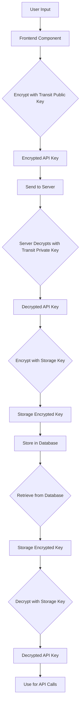

# Security Implementation

## API Key Encryption Flow

### Flow Diagram



### Detailed Flow Explanation

1. **Frontend**:
   - User enters API key in the component
   - Key is encrypted using `encryptForServer` with the transit public key
   - Encrypted key is sent to the server

2. **Backend - Initial Processing**:
   - Server receives encrypted API key
   - Decrypts using `decryptFromClient` with the transit private key
   - Encrypts again using `encryptForStorage` with the storage key
   - Stores the doubly-encrypted key in the database

3. **Backend - Usage**:
   - When needed, server retrieves the encrypted key from database
   - Decrypts using `decryptFromStorage` with the storage key
   - Uses the decrypted API key for making API calls

### Encryption Functions Overview

#### Client-Server Encryption (Asymmetric)
- `encryptForServer(data: string)`: Encrypts data using transit public key
- `decryptFromClient(encryptedData: string)`: Decrypts data using transit private key

#### Storage Encryption (Symmetric)
- `encryptForStorage(data: string)`: Encrypts data using storage key
- `decryptFromStorage(encryptedData: string)`: Decrypts data using storage key

### Key Management

#### Required Environment Variables
```bash
# Asymmetric Encryption (Client-Server transit)
NUXT_PUBLIC_TRANSIT_PUBLIC_KEY=base64-encoded-public-key
NUXT_TRANSIT_PRIVATE_KEY=base64-encoded-private-key

# Symmetric Encryption (Server-Side storage)
NUXT_STORAGE_ENCRYPTION_KEY=base64-encoded-32-byte-key

# Authentication
NUXT_SESSION_PASSWORD=password-with-at-least-32-characters
```

### Key Generation

#### 1. Generate Transit Keys (Client-Server)
```bash
pnpm keygen:transit
```

This will generate:
- `NUXT_PUBLIC_TRANSIT_PUBLIC_KEY`: Used by clients to encrypt data
- `NUXT_TRANSIT_PRIVATE_KEY`: Used by server to decrypt data

#### 2. Generate Storage Key (Server-Side)
```bash
pnpm keygen:storage
```

This will generate:
- `NUXT_STORAGE_ENCRYPTION_KEY`: Used for encrypting data at rest

#### 3. Generate Authentication Session Key
```bash
pnpm keygen:auth
```

This will generate:
- `NUXT_SESSION_PASSWORD`: Used for secure session management

### Key Verification
The system includes a `verifyStorageEncryptionKey` function that:
1. Checks if the encryption key exists
2. Validates the key length
3. Performs a test encryption/decryption cycle
4. Returns true if the key is valid and functional

### Security Recommendations

1. **Key Protection**:
   - Store encryption keys securely (e.g., secrets manager)
   - Never commit keys to version control
   - Use environment variables for key management

2. **Key Rotation**:
   - Rotate `NUXT_STORAGE_ENCRYPTION_KEY` periodically
   - Re-encrypt stored data with new key
   - Rotate transit keys as needed

3. **Access Control**:
   - Limit access to key generation tools
   - Restrict access to encryption utilities
   - Implement proper authentication and authorization

4. **Secure Storage**:
   - Use secure methods for storing environment variables
   - Consider using a secrets manager in production
   - Implement proper access controls for sensitive data

## Encryption System Overview

This application follows security best practices by implementing a dual-layer encryption system:

1. **Asymmetric Encryption** (Client-Server Transit):
   - Uses `crypto_box_seal` algorithm from libsodium
   - Public/Private key pair
   - Encrypts sensitive data before transmission from client to server

2. **Symmetric Encryption** (Server-Side Storage):
   - Uses `crypto_secretbox` algorithm from libsodium
   - Single secret key
   - Encrypts data at rest in the database

## Implementation Details

The encryption system is implemented in `server/utils/encryption.ts` with the following key functions:

### Asymmetric Encryption (Client-Server)
- `encryptForServer(data: string)`: Encrypts data using transit public key
- `decryptFromClient(encryptedData: string)`: Decrypts data using transit private key

### Symmetric Encryption (Server-Side)
- `encryptForStorage(data: string)`: Encrypts data using storage encryption key
- `decryptFromStorage(encryptedData: string)`: Decrypts data using same key

### Key Generation
- `generatePrivatePublicKeyPair()`: Creates transit public/private key pair
- `generateEncryptionKey()`: Creates secret key for storage or session

These utilities are used throughout the application to ensure sensitive data is properly protected both in transit and at rest.

## Runtime Configuration

In `nuxt.config.ts`, the encryption keys are configured as follows:

```typescript
runtimeConfig: {
  public: {
    transitPublicKey: process.env.NUXT_PUBLIC_TRANSIT_PUBLIC_KEY,
    // Other public config...
  },
  transitPrivateKey: process.env.NUXT_TRANSIT_PRIVATE_KEY,
  storageEncryptionKey: process.env.NUXT_STORAGE_ENCRYPTION_KEY,
  // Other private config...
}
```

This ensures proper separation of public keys (available to the client) and private keys (only available on the server).
